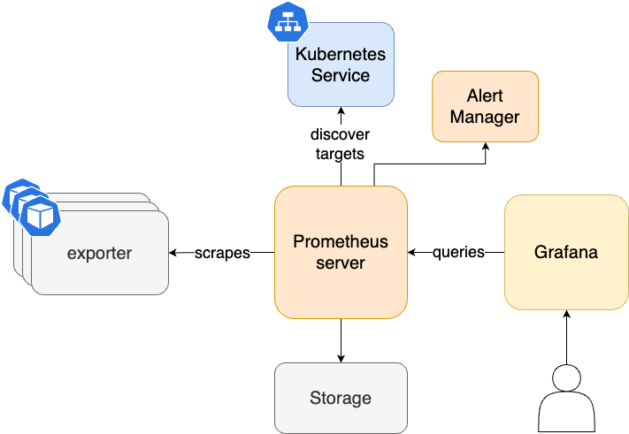

# Metrics Tools: Prometheus Operator

The Observability Stack uses Prometheus for storing local metrics data across both `observee` and `observer` clusters. It relies on the [rancher-monitoring](https://github.com/rancher/charts/tree/dev-v2.9/charts/rancher-monitoring/102.0.0%2Bup40.1.2) Helm Chart, which is derived from the kube-prometheus helm chart, for deployment.

## Architecture
<div style={{textAlign: 'center'}}>

</div>

## Quickstart

In order to integrate Prometheus instances on `observee` clusters with the central Thanos setup on the `observer` cluster, the Helm chart must be configured with the `prometheus.prometheusSpec.thanos` configuration:

```yaml
prometheus:
  prometheusSpec:
    thanos:
      image: quay.io/thanos/thanos:v0.34.0
      objectStorageConfig:
        key: thanos.yaml
        name: thanos-objectstorage
```
This configuration requires the thanos-objectstorage S3 connection details, structured as follows:

```yaml
type: S3
config:
  bucket: <thanos-object-storage-bucket-name>
  endpoint: <s3-endpoint>
  region: <region>
  aws_sdk_auth: false
  access_key: <access_key>
  insecure: false
  signature_version2: false  # Equivalent to v4auth: true
  secret_key: <secret_key>
  bucket_lookup_type: path  # Equivalent to pathstyle: true
```

To create this secret via kubectl, use the following command, ensuring your YAML manifest is saved to a file (e.g., thanos-s3-creds.yaml):

```bash
kubectl create secret generic thanos-objectstorage --from-file=thanos-s3-creds.yaml
```

For Rancher Cluster Manager deployments, two additional parameters needs to be set in the `values.yaml` in order to integrate Rancher Cluster Management UI with the integrated monitoring (for more information, you can check this [Github issue](https://github.com/rancher/rancher/issues/40687)).

```yaml
global:
  cattle:
    clusterId: global.fleet.clusterLabels.management.cattle.io/cluster-name
    clusterName: global.fleet.clusterLabels.management.cattle.io/cluster-display-name
```
An example `values.yaml` is provided within the repository.

## Advanced Configuration

### Special Configuration for Envoy Sidecar Approach
When utilizing [Envoy Sidecar for Thanos](#envoy-sidecar-for-thanos) to enable connectivity between Prometheus and Thanos instances across `observer` and `observee` clusters, it may be necessary to make the sidecar component accessible through an ingress object. This requires specific annotations to support the backend-protocol: "GRPC".

```yaml
apiVersion: networking.k8s.io/v1
kind: Ingress
metadata:
  name: observability-thanos-gateway
  annotations:
    nginx.ingress.kubernetes.io/backend-protocol: "GRPC"
    nginx.ingress.kubernetes.io/force-ssl-redirect: "true"
    nginx.ingress.kubernetes.io/grpc-backend: "true"
    nginx.ingress.kubernetes.io/protocol: "h2c"
    nginx.ingress.kubernetes.io/proxy-read-timeout: "160"
spec:
  ingressClassName: nginx
  rules:
    - host: [clusterName].observability.[yourdomain].com
      http:
        paths:
          - backend:
              service:
                name: prometheus-operated
                port:
                  number: 10901
            path: /
            pathType: Prefix
  tls:
    - hosts:
        - [clusterName].observability.[yourdomain].com
      secretName: thanos-gateway-tls
```
To automate deployment across both `observer` and `observee` clusters, the Observability Stack leverages `overlays` and `targetCustomizations` in Fleet. Example configurations for deploying in `observer` and `observee` clusters are located within `overlays/observee-cluster01` and `overlays/observer-cluster` directories, respectively. If cert-manager is set up in your cluster, it's possible to automate the generation of SSL certificates for ingress objects. Additionally, external-dns can be utilized alongside to dynamically generate DNS records.

### Thanos Sidecar Monitor

In order to enable the Thanos sidecar metrics gathering, a `ServiceMonitor` object needs to be created as a seperate object. An example configuration is under the `base` directory and can be used directly.

```yaml
apiVersion: monitoring.coreos.com/v1
kind: ServiceMonitor
metadata:
  name: rancher-monitoring-thanos-sidecar
  labels:
    app: rancher-monitoring-prometheus
spec:
  namespaceSelector:
    matchNames:
      - cattle-monitoring-system
  selector:
    matchLabels:
      app: rancher-monitoring-thanos-discovery
      release: rancher-monitoring
  endpoints:
    - port: http
      path: /metrics
```
### External Secrets
For an automated setup, the S3 connection secret `thanos-s3-creds.yaml` should be integrated into the `base` directory alongside the Prometheus components. A corresponding `kustomization.yaml` file ensures the automatic creation of the secret. This setup supports both regular Kubernetes secrets (without encryption) and more secure approaches like integrating with [HashiCorp Vault](https://www.vaultproject.io/), utilizing the [external-secrets-operator](https://external-secrets.io/latest/) to import the secret as an ExternalSecret object.