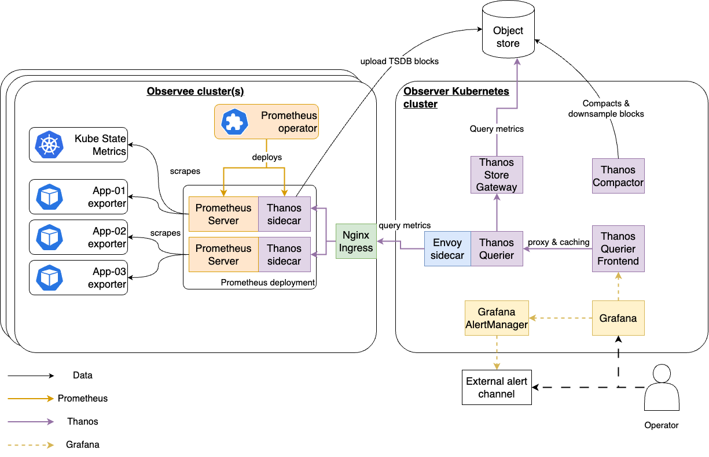

# Metrics Tools: Thanos

Thanos is used within the Observability Stack for the long-term storage and centralization of Prometheus metrics data. It relies on the [Thanos Bitnami Helm Chart](https://github.com/bitnami/charts/tree/main/bitnami/thanos/).
## Architecture

<div style={{textAlign: 'center'}}>

</div>


## Quickstart
The Observability Stack recommends creating a Kubernetes secret named "thanos-objectstorage" for Thanos S3 connection details. This secret should then be mounted using the `existingObjstoreSecret` field in the Helm chart values, rather than passing the values directly to the Helm chart or as an argument.

The S3 connection YAML manifest should follow this format:

```yaml
type: S3
config:
  bucket: <thanos-object-storage-bucket-name>
  endpoint: <s3-endpoint>
  region: <region>
  aws_sdk_auth: false
  access_key: <access_key>
  insecure: false
  signature_version2: false  # Equivalent to v4auth: true
  secret_key: <secret_key>
  bucket_lookup_type: path  # Equivalent to pathstyle: true
```

More details can be found in the [Thanos documentation](https://thanos.io/tip/thanos/storage.md/#s3).

To create this secret via kubectl, use the following command, ensuring your YAML manifest is saved to a file (e.g., thanos-s3-creds.yaml):

```bash
kubectl create secret generic thanos-objectstorage --from-file=thanos-s3-creds.yaml
```

## Advanced Configuration

### Envoy Sidecar for Thanos

Utilizing an Envoy sidecar presents a viable alternative for enabling cross-cluster communications between observer and observee clusters, especially in situations where setting up a VPN or cluster mesh is too complex or expensive to set up or maintain. In such a scenario, the `observer` cluster, which hosts Thanos, would require connections to multiple remote Thanos Sidecar instances located within `observee` clusters. (e.g., to their ingress endpoints, of which the configs below are based).

To achieve this, the query sidecar component within the Thanos Helm Chart `values.yaml` manifest needs to be configured. An example configuration snippet can be seen below;

```yaml
  query:
    enabled: true
    replicaLabel:
      - "prometheus_replica"
      - "rule_replica"
    dnsDiscovery:
      sidecarsService: "prometheus-operated"
      sidecarsNamespace: "cattle-monitoring-system" # the namespace of the prometheus deployment. (this is cattle-monitoring-system for rancher-monitoring operator)
    sidecars:
      - name: observer-envoy-sidecar
        args:
          - "-c"
          - /config/envoy.yaml
        image: "envoyproxy/envoy:v1.16.0"
        ports:
          - name: envoy-observee01
            containerPort: 10000
            protocol: TCP
        volumeMounts:
          - name: envoy-config
            mountPath: "/config"
            mountPropagation: None
    extraVolumes:
      - name: envoy-config
        configMap:
          name: thanos-envoy-config
          defaultMode: 420
          optional: false
    stores:
      - "dnssrv+_envoy-observee01._tcp.thanos-envoy-sidecar.thanos-system.svc.observer.local"
      - "dnssrv+_[port_name]._tcp.[service-name].[namespace].svc.[clusterDomain].local"
```
For an automated Envoy v3 configuration into the Envoy sidecars, the ConfigMap should be integrated into the `base` directory alongside with corresponding `kustomization.yaml` file ensures automatic creation of the ConfigMap.

An example Envoy v3 ConfigMap `envoy-v3.yaml` and `kustomization.yaml`  can be seen below and under `base` directory;

```yaml
  apiVersion: v1
  kind: Service
  metadata:
    name: thanos-envoy-sidecar
    labels:
      name: thanos-envoy-sidecar
  spec:
    type: ClusterIP
    selector:
      app.kubernetes.io/component: query
      app.kubernetes.io/managed-by: Helm
      app.kubernetes.io/name: thanos
    ports:
      - name: envoy-observee01
        protocol: TCP
        port: 10000
        targetPort: 10000
    sessionAffinity: "None"
  ---
  apiVersion: v1
  kind: ConfigMap
  metadata:
    name: thanos-envoy-config
  data:
    envoy.yaml: |
      admin:
        access_log_path: /tmp/admin_access.log
        address:
          socket_address: { address: 0.0.0.0, port_value: 9901 }

      static_resources:
        listeners:
        - name: envoy-observee01
          address:
            socket_address:
              address: 0.0.0.0
              port_value: 10000
          filter_chains:
          - filters:
            - name: envoy.http_connection_manager
              typed_config:
                "@type": type.googleapis.com/envoy.extensions.filters.network.http_connection_manager.v3.HttpConnectionManager
                codec_type: AUTO
                access_log:
                - name: envoy.access_loggers.file
                  typed_config:
                    "@type": type.googleapis.com/envoy.extensions.access_loggers.file.v3.FileAccessLog
                    path: /dev/stdout
                    log_format:
                      text_format: |
                        [%START_TIME%] "%REQ(:METHOD)% %REQ(X-ENVOY-ORIGINAL-PATH?:PATH)% %PROTOCOL%"
                        %RESPONSE_CODE% %RESPONSE_FLAGS% %RESPONSE_CODE_DETAILS% %BYTES_RECEIVED% %BYTES_SENT% %DURATION%
                        %RESP(X-ENVOY-UPSTREAM-SERVICE-TIME)% "%REQ(X-FORWARDED-FOR)%" "%REQ(USER-AGENT)%"
                        "%REQ(X-REQUEST-ID)%" "%REQ(:AUTHORITY)%" "%UPSTREAM_HOST%" "%UPSTREAM_TRANSPORT_FAILURE_REASON%"\n   
                - name: envoy.access_loggers.file
                  typed_config:
                    "@type": type.googleapis.com/envoy.extensions.access_loggers.file.v3.FileAccessLog
                    path: /dev/stdout
                stat_prefix: ingress_http
                route_config:
                  name: local_route
                  virtual_hosts:
                  - name: local_service
                    domains: ["*"]
                    routes:
                    - match:
                        prefix: "/"
                      route: 
                        cluster: envoy-observee01
                        host_rewrite_literal: prometheus-envoy-observee01.observability.[yourdomain].com
                http_filters:
                - name: envoy.filters.http.router
        clusters:
        - name: envoy-observee01
          connect_timeout: 30s
          type: LOGICAL_DNS
          http2_protocol_options: {}
          dns_lookup_family: V4_ONLY
          lb_policy: ROUND_ROBIN
          load_assignment:
            cluster_name: envoy-observee01
            endpoints:
              - lb_endpoints:
                - endpoint:
                    address:
                      socket_address:
                        address: prometheus-envoy-observee01.observability.[yourdomain].com
                        port_value: 443
          transport_socket:
            name: envoy.transport_sockets.tls
            typed_config:
              "@type": type.googleapis.com/envoy.extensions.transport_sockets.tls.v3.UpstreamTlsContext
              common_tls_context:
                alpn_protocols:
                - h2
                - http/1.1
              sni: prometheus-envoy-observee01.observability.[yourdomain].com
```

For detailed information, you can refer to the [Thanos Documentation for Cross-cluster communication](https://thanos.io/tip/operating/cross-cluster-tls-communication.md/).

### External Secrets
For an automated setup, the S3 connection secret `thanos-s3-creds.yaml` should be integrated into the `base` directory alongside the Thanos and Prometheus metrics components. A corresponding `kustomization.yaml` file ensures the automatic creation of the secret. This setup supports both regular Kubernetes secrets (without encryption) and more secure approaches like integrating with [HashiCorp Vault](https://www.vaultproject.io/), utilizing the [external-secrets-operator](https://external-secrets.io/latest/) to import the secret as an ExternalSecret object.

