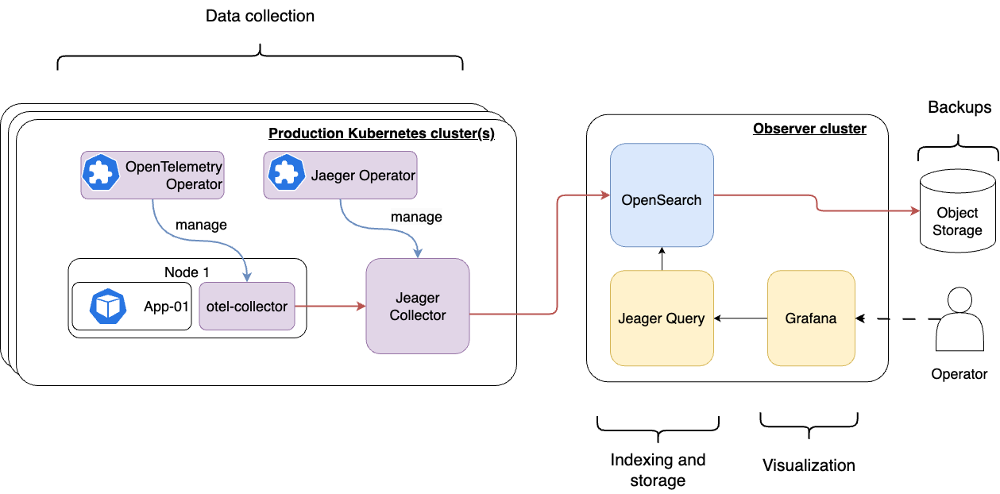

# Traces Tools: Jaeger

Within the Observability Stack, Jaeger plays an intermediary role in trace data collection. It leverages the Jaeger operator available on [OperatorHub.io](https://operatorhub.io/operator/jaeger). The setup involves configuring the OpenTelemetry Collector (deployed in a daemonset mode) to forward OTLP trace data directly to the Jaeger collector. The Jaeger collector then utilizes the centralized Opensearch cluster as its backend storage for these traces, enabling seamless integration with the available Observability Stack toolkit. For detailed insights, refer to the [logs section](./logs).

This architecture enables Grafana to utilize Jaeger as a datasource, enhancing visualization capabilities by showcasing traces with logs and metrics. Additionally, Jaeger undertakes the management of Opensearch indices lifecycle through the `jaeger-tracing-es-index-cleaner`, ensuring efficient storage handling.

The Observability Stack deploys the Jaeger collector across both `observer` and `observee` clusters. However, Jeager deployment in the `observer` cluster can use the internal service discovery for accessing the central Opensearch cluster, while Jeager deployments on `observee` clusters might require an external URL (e.g., ingress) to access the Opensearch APIs. Therefore, a special configuration might be needed according to the requirements of centralized data processing and storage. 

This differentiation in configuration is achieved through the use of Kustomize overlays, specifically the `overlays/observer-cluster`, which is referenced in the Fleet deployment strategy. 

```yaml
targetCustomizations:
  - name: observer-cluster
    clusterName: observer-cluster
    kustomize:
      dir: overlays/observer-cluster
```

## Architecture
<div style={{textAlign: 'center'}}>

</div>

## Quickstart
The Observability Stack recommends creating a Kubernetes secret named "opensearch-admin-credential" for Jeager - Opensearch API connection details. This secret should then be mounted using the `spec.secretName` field in the Jeager cluster values.

The S3 connection YAML manifest should follow this format:

```yaml
apiVersion: v1
kind: Secret
metadata:
  name: opensearch-admin-credential
  namespace: tracing-system
type: Opaque
data:
  username: b3BlbnNlYXJjaC1hZG1pbg== #base64
  password: cGxlYXNlRG9udFVzZVRoaXM= #base64
```

To create this secret via kubectl, use the following command, ensuring your YAML manifest is saved to a file (e.g., opensearch-admin-credential.yaml:

```bash
kubectl create secret generic opensearch-admin-credential -f opensearch-admin-credential.yaml
```

For external access to the Opensearch APIs from observee clusters—particularly in scenarios where internal cross-cluster communication isn't available—it's necessary to specify the external URL in the jaeger.yaml manifest. This configuration file is located under the cluster/base directory. Here's how you can define it;

```yaml
spec:
  storage:
    type: elasticsearch
    options:
      es.server-urls: https://<opensearch-api-externalURL>
```

## Advanced Configuration
For an automated setup, the secret should be integrated into the `cluster/base` directory alongside with Jaeger components. A corresponding `kustomization.yaml` file ensures automatic creation of the secret. This setup supports both regular Kubernetes secrets (without encryption) and more secure approaches like integrating with [HashiCorp Vault](https://www.vaultproject.io/), utilizing the [external-secrets-operator](https://external-secrets.io/latest/) to import the secret as an ExternalSecret object.

```yaml
apiVersion: external-secrets.io/v1beta1
kind: ExternalSecret
metadata:
  name: opensearch-admin-credential
spec:
  dataFrom:
    - extract:
        key: tracing/opensearch-admin-credential
  refreshInterval: 1h
  secretStoreRef:
    kind: ClusterSecretStore
    name: hashicorp-vault-backend
  target:
    creationPolicy: Owner
    deletionPolicy: Retain
    name: opensearch-admin-credential
```