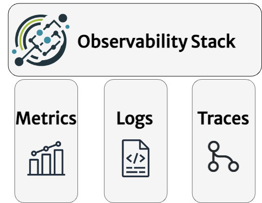
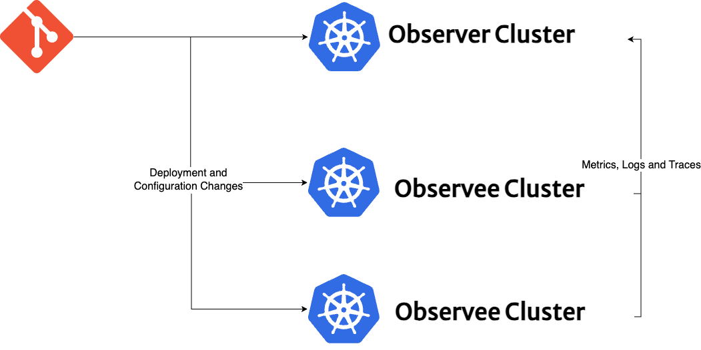

In 20 minutes, we'll explore the the key features that will be introduced in the Observability Stack.

## Pillars of Observability (Stack)

Observability is an approach to understanding and monitoring systems, most often defined by the three pillars **metrics**, **logs**, and **traces**. Unlike traditional monitoring or standalone logging solutions that may offer siloed views, observability aims to integrate these three critical data sources into a unified platform, offering insights into both infrastructure and application performance, particularly beneficial for cloud-native applications and microservice architectures. 

Observability Stack serves as an umbrella project, leveraging the open-source ecosystem and integrating **GitOps** as a core pillar. This integration provides administrators and developers with a versatile toolkit to build their own custom observability platform, tailored to their unique operational requirements. Another key feature of the Observability Stack is its inherent multi-cloud and multi-cluster capability. Designed to keep the multi-cloud and multi-cluster scenarios in mind and by adopting GitOps best practices, Observability Stack automates the configuration process across every cluster. This automation ensures the seamless transmission of metrics, logs, and tracing data to a centralized **"observer"** cluster.

While the Observability Stack adopts a Kubernetes-first approach, it can also support external citizens such as Virtual Machines (VMs) or specific applications like HAProxy (e.g, with a **node-exporter** combined with `additionalScrapeConfigs` in **prometheus-operator**), allowing them to transmit observability data to the central "observer" cluster. 

Overall architectural details, detailed customizations, available toolkit, and best practices for integrating external citizens are further elaborated in separate categories within the [Available Toolkit](../category/available-toolkit) and [Best Practices](../category/how-to-guides) sections.

## Key Concepts

Observability Stack intruduces several key components to the equation to provide logical abstraction between observer and observee clusters and their duties. 

### Fleet Components

Observability stack uses [Fleet](https://fleet.rancher.io/) for the distribution of its components and the management of their lifecycle. While the potential exists for other GitOps tools to substitute Fleet (e.g, [Flux CD](https://fluxcd.io/)), such alternatives have not been tested yet. The installation and configuration management of the Observability Stack across both [observer](#observer-cluster) and [observee](#observee-clusters) clusters are handled by the [Fleet Agent](#key-components-of-fleet-within-the-observability-stack). Using Fleet, along with `Cluster Labels` and `Cluster Groups`, each cluster configured to transmit their observability data, ensuring that the observer cluster has a centralized dataset to analyze. 

Fleet offers two different deployment scenarios: a single-cluster configuration, where the fleet manager and fleet agent coexist within the same cluster, and a multi-cluster mode, where a singular fleet manager controls multiple fleet agents across distributed clusters. 

The Observability Stack assumes a multi-cluster setup by default.

#### Key Components of Fleet within the Observability Stack:

* **Fleet Manager:** Fleet manager is the component that orchestrates the deployments of Kubernetes assets from git repositories. 
* **Fleet Agent:** Every downstream cluster runs a Fleet agent that communicates with the Fleet manager which applies the configuration changes and modifications.
* **Downstream Cluster:** The target clusters where Fleet deploys the manifests are known as downstream clusters, receiving the configurations and updates as dictated by the Fleet manager.
* **Cluster Labels:** Each cluster registered as a downstream cluster to Fleet Manager can be labelled with standart `metav1.LabelSelector` format to match clusters by labels to form Cluster Groups.
* **Cluster Group:** Clusters connected to the same Fleet Manager can be organized into groups with a `matchLabels` selector. For the Observability Stack, you can use the label `observability-role: observer` to identify the **Observer Cluster** and `observability-role: observee` for the **Observee Clusters**. 
* **GitRepo:**  A Custom Resource Definition (CRD) introduced by Fleet, the `GitRepo` monitors specified Git repositories for changes, deploying them as bundles to downstream clusters.
* **Bundle:**  A bundle encompasses a set of Kubernetes resources and configurations, delineated within a Git repository. These bundles are observed by the `GitRepo` CRD and deployed to downstream clusters.

More information on Fleet and it's concepts is available on [Official Fleet Website](https://fleet.rancher.io/concepts) and how Observability Stack uses [Fleet](available-toolkit/gitops/fleet).

### Observer Cluster

The Observer Cluster functions as the hub for data aggregation and analysis within the Observability Stack, distinguishing itself by hosting specific applications not present in the observee clusters, such as [Grafana](available-toolkit/dashboards/grafana), [Opensearch](available-toolkit/logs/opensearch), and [Thanos](available-toolkit/metrics/thanos) to centralize metrics, logs, and traces. To clearly define its unique function, observer clusters are assigned two specific cluster labels: `observability-enabled: true` and `observability-role: observer`.

The Observer Cluster can also host the [Fleet Manager](#key-components-of-fleet-within-the-observability-stack), providing an alternative option for users who prefer not to deploy the [Rancher Cluster Manager which integrates with Fleet](https://ranchermanager.docs.rancher.com/how-to-guides/new-user-guides/deploy-apps-across-clusters/fleet) for managing downstream clusters. 

Futher details for integrating the Rancher Cluster Manager and Fleet are available in [Rancher Cluster Manager and Fleet Reference Architecture Guide](../catagory/how-to-guides/rancher-cluster-manager).

### Observee Cluster(s)

Observee Cluster(s) are the source clusters that generate observability data. Each observee cluster runs [Fluentd log forwarder](https://kube-logging.dev/docs/logging-infrastructure/fluentd/) and [Fluent Bit log collector](https://kube-logging.dev/docs/logging-infrastructure/fluentbit/), [Thanos sidecar](https://thanos.io/tip/components/sidecar.md/) and [OpenTelemetry collector](https://opentelemetry.io/docs/collector/) with [Jaeger Collector](https://www.jaegertracing.io/docs/1.54/architecture/#with-opentelemetry-collector) responsible for forwarding its metrics, logs, and tracing data to the Observer Cluster. Observee clusters are assigned two specific cluster labels: `observability-enabled: true` and `observability-role: observee` to indicate their role in the Observability Stack, which can span across multiple clouds and operational domains. 