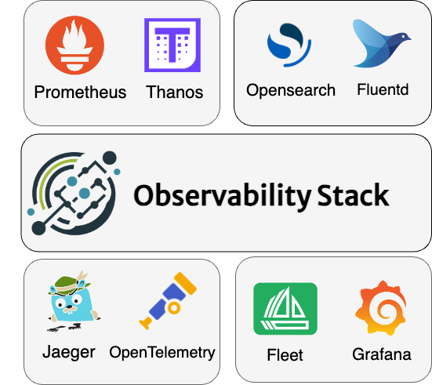

# What is Observability Stack?

Observability Stack is an umbrella project, leveraging the open-source ecosystem to provide a platform independent, community-driven and flexible observability toolkit. It aims to serve as a central resource for administrators and developeres alike by providing design concepts, examples, how-to guides and reference architectures to navigate the complexities of observability tools.

It's important to highlight that, in contrast to widely recognized end-user products (e.g., Opensearch, Grafana Stack), Observability Stack does not serve as an out-of-the-box solution or a specific observability tool. Instead, it offers a framework for administrators and developers to build their solutions tailored to their unique requirements.

## Design Principles

* 🌐 **Open-source Ecosystem:** Observability Stack builds upon a suite of open source projects and de-facto standarts to provide a platform independent, community-driven and flexible observability toolkit for everyone.
* ☁️ **Multi-cloud and Multi-cluster:**  While observability standards for single-cloud and single-cluster environments are pretty much established, our Observability Stack is intentionally crafted to keep multi-cloud and multi-cluster scenarios in mind, ensuring scalability and flexibility for organizations of all sizes.
* ⚙️ **GitOps and Automation:** Multi-cluster means multi-trouble. Observability Stack aims to reduce the installation and day-2 operation overheat of the multi-cluster observability by embracing GitOps best practices and automatically configuring clusters to transmit metrics, logs, and tracing data to a central "observer" cluster, ensuring consistency within multi-cluster setup.
* 👥 **Community Focused:**  By improving documentation and contributing our findings to observability-related open-source projects, we aim to strengthen both our resources and those of the projects we rely on, creating a two-way relationship that elevates the observability landscape as a whole.
* 📚 **Adhere to Best Practices:** The wheel doesn't need to be reinvented! By adhering to the best practices in both cloud-native and observability fields, Observability Stack aims to provide a universal framework for both administrators and developers alike.